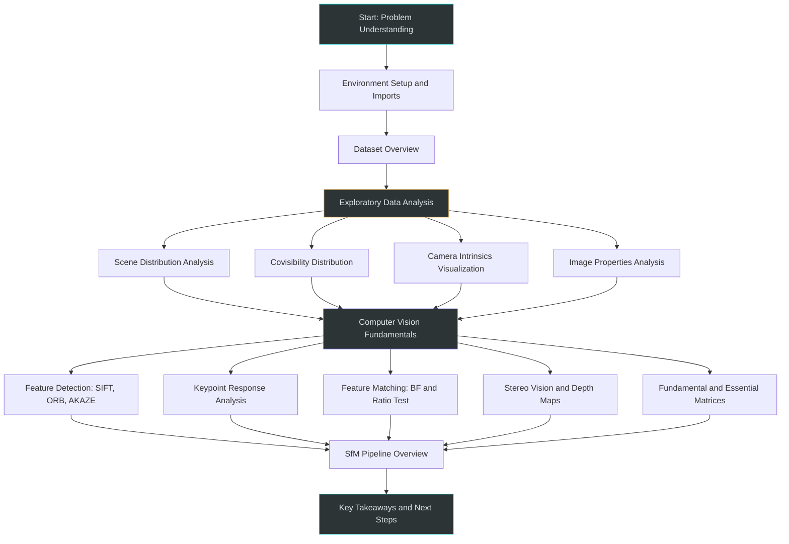
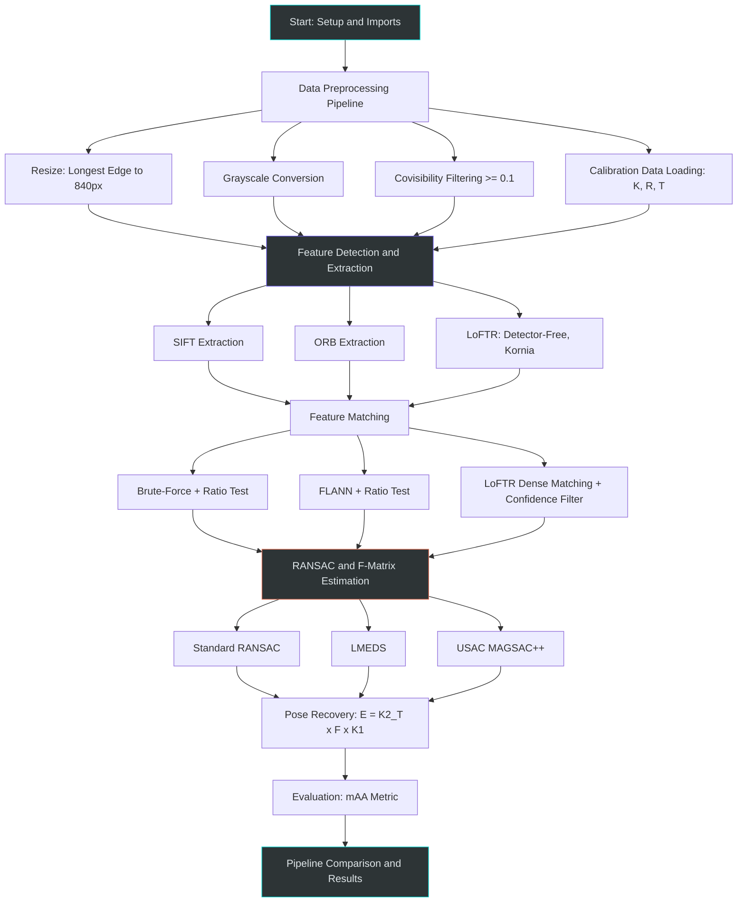
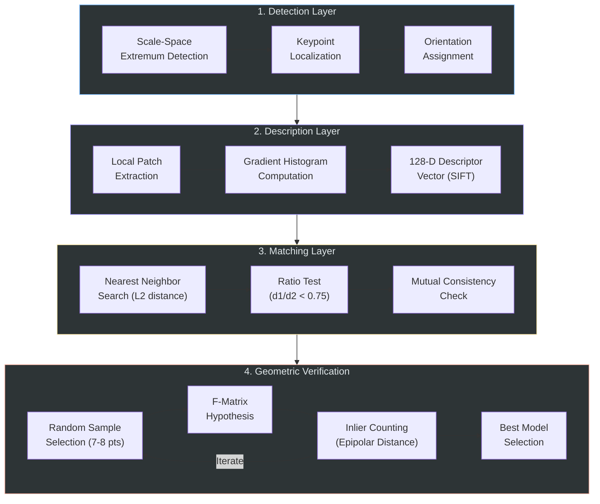
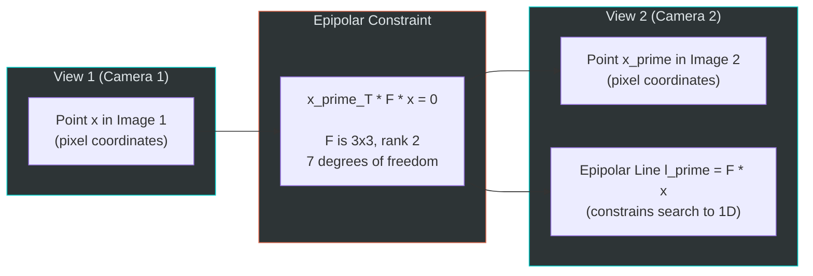
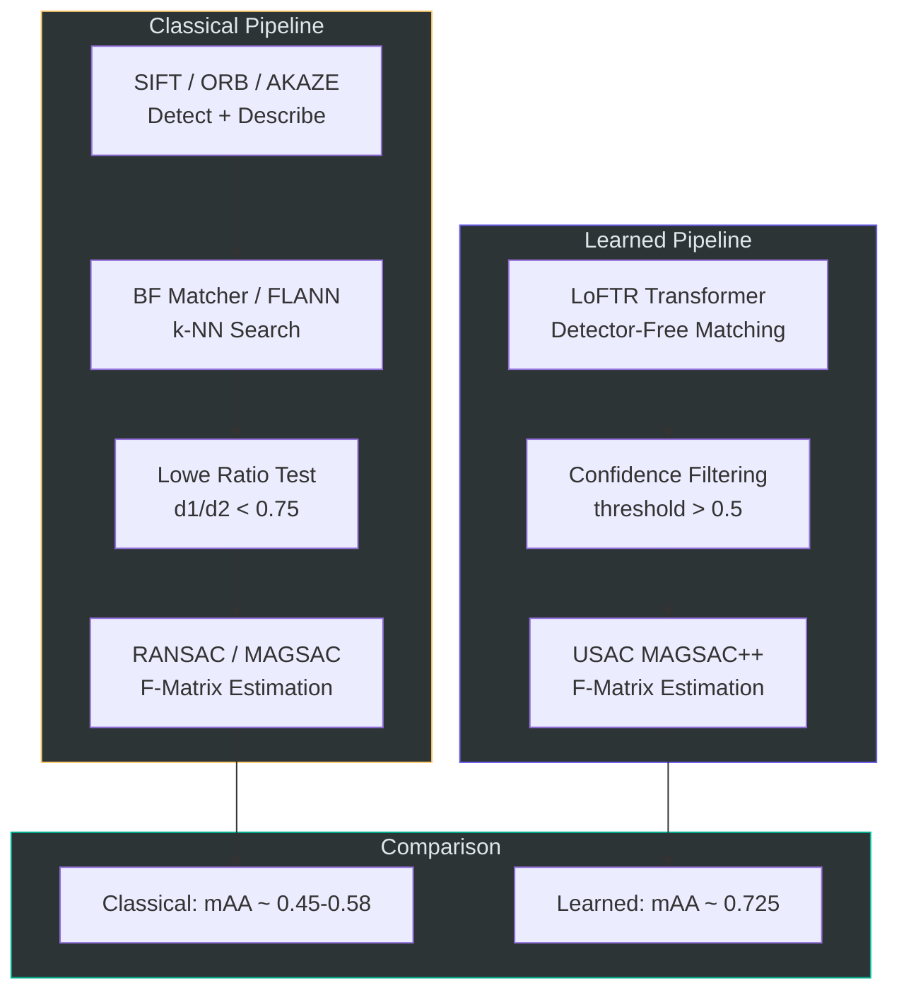

# Image Matching Challenge 2022

A comprehensive study and implementation of image matching techniques for the [Kaggle Image Matching Challenge 2022](https://www.kaggle.com/competitions/image-matching-challenge-2022). This repository contains two detailed Jupyter notebooks that cover everything from exploratory data analysis and computer vision fundamentals to a full cumulative feature matching pipeline.

---

## Table of Contents

- [Project Overview](#project-overview)
- [Dataset](#dataset)
- [Repository Structure](#repository-structure)
- [Notebook Flow](#notebook-flow)
- [Feature Matching Architecture](#feature-matching-architecture)
- [Classical vs Learned Pipeline](#classical-vs-learned-pipeline)
- [Key Techniques](#key-techniques)
- [Results Summary](#results-summary)
- [References and Acknowledgements](#references-and-acknowledgements)

---

## Project Overview

The goal of this project is to estimate the **fundamental matrix** between pairs of images taken from different viewpoints. The fundamental matrix encodes the epipolar geometry between two views and is a core component of **Structure from Motion (SfM)** — the process of reconstructing 3D scenes from 2D images.

This repository distills and builds upon techniques from four competition notebooks (stored separately in the `old/` directory for reference) and presents them in two clean, well-documented notebooks with interactive Plotly dark-mode visualizations.

---

## Dataset

The dataset is provided by the [Kaggle Image Matching Challenge 2022](https://www.kaggle.com/competitions/image-matching-challenge-2022/data) competition, hosted by Google in collaboration with the University of British Columbia and Czech Technical University.

### Dataset Structure

```
kaggle-dataset/
|-- train/
|   |-- <scene_name>/
|   |   |-- calibration.csv        # Camera intrinsics (K), rotation (R), translation (T)
|   |   |-- pair_covisibility.csv   # Image pairs, covisibility scores, ground truth F
|   |   |-- images/                 # Scene images (JPG)
|   |-- scaling_factors.csv         # Per-scene scaling factors (SfM poses to meters)
|
|-- test.csv                        # ~10,000 test image pairs
|-- test_images/                    # Test images (longest edge ~800px)
|-- sample_submission.csv           # Submission format: sample_id, fundamental_matrix
|-- train.csv                       # Scene listing
```

### Key Dataset Details

| Field | Description |
|:------|:------------|
| `camera_intrinsics` | 3x3 calibration matrix K (focal length, principal point) |
| `rotation_matrix` | 3x3 rotation matrix R per image |
| `translation_vector` | 3D translation vector T per image |
| `covisibility` | Overlap estimate between image pairs (recommended threshold >= 0.1) |
| `fundamental_matrix` | 3x3 ground truth matrix (target), flattened row-major |

### Scenes

The training set contains 16 landmark scenes including British Museum, Florence Cathedral, Lincoln Memorial, Trevi Fountain, Taj Mahal, Sacre Coeur, and others. Test images are from urban scenes with variable overlap, captured months or years apart.

### Important Notes

- Images are resized so the **longest edge is approximately 800 pixels**
- Images may have **different aspect ratios** (portrait and landscape)
- Test images come from a **different domain** than training images (domain gap)

---

## Repository Structure

```
Image-Matching-Challenge/
|
|-- README.md                                        # This file
|-- 01_image_matching_eda_cv_fundamentals.ipynb       # Notebook 1: EDA and CV basics
|-- 02_feature_matching_pipeline.ipynb                # Notebook 2: Full matching pipeline
```

### Notebook Descriptions

| Notebook | Focus | Key Topics |
|:---------|:------|:-----------|
| `01_image_matching_eda_cv_fundamentals.ipynb` | Understanding the data and CV basics | Dataset EDA, SIFT/ORB/AKAZE detection, feature matching basics, stereo vision, fundamental matrix theory |
| `02_feature_matching_pipeline.ipynb` | Cumulative best matching pipeline | Preprocessing, SIFT and LoFTR extraction, BF/FLANN matching, RANSAC/MAGSAC estimation, mAA evaluation |

---

## Notebook Flow

### Notebook 1 — EDA and Computer Vision Fundamentals



### Notebook 2 — Cumulative Feature Matching Pipeline



---

## Feature Matching Architecture

### End-to-End Image Matching Pipeline

The following diagram shows the complete architecture from raw image input to the final fundamental matrix output:

```mermaid
flowchart LR
    subgraph INPUT ["Input"]
        I1[Image 1]
        I2[Image 2]
    end

    subgraph PREPROCESS ["Preprocessing"]
        P1[Resize to 840px]
        P2[Convert to Grayscale]
    end

    subgraph FEATURES ["Feature Extraction"]
        direction TB
        F1["Classical Path\n(SIFT / ORB / AKAZE)"]
        F2["Learned Path\n(LoFTR / SuperPoint)"]
    end

    subgraph MATCHING ["Feature Matching"]
        direction TB
        M1["Classical Matching\nBF or FLANN\n+ Lowe Ratio Test"]
        M2["Dense Matching\nLoFTR Transformer\n+ Confidence Threshold"]
    end

    subgraph ESTIMATION ["Robust Estimation"]
        R1["RANSAC Variants\nRANSAC / LMEDS\nUSAC MAGSAC++"]
    end

    subgraph OUTPUT ["Output"]
        O1["Fundamental Matrix F\n(3x3, rank 2)"]
        O2["Essential Matrix E\nE = K2_T x F x K1"]
        O3["Relative Pose\nR (rotation)\nT (translation)"]
    end

    I1 --> P1
    I2 --> P1
    P1 --> P2
    P2 --> F1
    P2 --> F2
    F1 --> M1
    F2 --> M2
    M1 --> R1
    M2 --> R1
    R1 --> O1
    O1 --> O2
    O2 --> O3

    style INPUT fill:#1a1a2e,stroke:#00cec9,color:#dfe6e9
    style PREPROCESS fill:#1a1a2e,stroke:#fdcb6e,color:#dfe6e9
    style FEATURES fill:#1a1a2e,stroke:#6c5ce7,color:#dfe6e9
    style MATCHING fill:#1a1a2e,stroke:#e17055,color:#dfe6e9
    style ESTIMATION fill:#1a1a2e,stroke:#00b894,color:#dfe6e9
    style OUTPUT fill:#1a1a2e,stroke:#ff7675,color:#dfe6e9
```



### How Feature Matching Works

Feature matching is the process of finding corresponding points between two images of the same scene. The architecture involves several layers of processing:



### Epipolar Geometry

The fundamental matrix F defines the relationship between corresponding points across two views:



---

## Classical vs Learned Pipeline



---

## Key Techniques

### Preprocessing (Cumulative from all notebooks)

| Step | Detail | Source |
|:-----|:-------|:-------|
| Image Resize | Scale longest edge to 840 pixels | Kornia notebook |
| Grayscale | Convert BGR to grayscale for detection | SIFT notebook |
| Covisibility Filter | Keep pairs with covisibility >= 0.1 | EDA notebook |
| Calibration Parsing | Load K, R, T matrices from CSV | SIFT notebook |
| Keypoint Normalization | Normalize using camera intrinsics | SIFT notebook |

### Feature Detection

| Method | Type | Descriptor Dim | Strengths |
|:-------|:-----|:---------------|:----------|
| SIFT | Classical | 128-D float | Scale/rotation invariant, most robust classical |
| ORB | Classical | 32-D binary | Fast, rotation invariant, no patent |
| AKAZE | Classical | Variable | Non-linear scale space, good for textureless |
| SuperPoint | Learned | 256-D float | Trained on synthetic data, strong repeatability |
| LoFTR | Learned | N/A (detector-free) | Transformer-based, handles textureless regions |

### RANSAC Variants

| Method | Description | Performance |
|:-------|:------------|:------------|
| FM_RANSAC | Standard RANSAC with fixed threshold | Baseline |
| FM_LMEDS | Least Median of Squares (no threshold needed) | Slightly worse |
| USAC_MAGSAC | Marginalized sample consensus, adaptive threshold | Best results |

### Evaluation Metric

The competition uses **mAA (mean Average Accuracy)** evaluated at 10 threshold pairs:

- Rotation thresholds: 1 to 10 degrees (linearly spaced)
- Translation thresholds: 0.2 to 5 meters (geometrically spaced)
- A pose is "accurate" if it meets both rotation AND translation thresholds
- mAA is computed per scene and averaged across all scenes

---

## Results Summary

| Pipeline | Feature Method | Matcher | RANSAC | mAA Score |
|:---------|:---------------|:--------|:-------|:----------|
| Baseline | SIFT | BF + Ratio Test | RANSAC | ~0.45 |
| Improved | SIFT | FLANN + Ratio Test | MAGSAC++ | ~0.52 |
| Optimized | SIFT (8000 features) | BF + Ratio Test | MAGSAC++ | ~0.58 |
| Best | LoFTR (Kornia) | Dense + Confidence | MAGSAC++ | **0.725** |

The best-performing pipeline uses **LoFTR** (a detector-free transformer-based matcher from the Kornia library) combined with **USAC MAGSAC++** for robust fundamental matrix estimation.

---

## References and Acknowledgements

### Source Notebooks

These notebooks were built upon techniques and approaches from:

1. **`image-matching-challenge-2022-eda.ipynb`** by Darien Schettler — Comprehensive EDA that provided the foundational understanding of the dataset, competition structure, and evaluation metrics. This was a primary reference for Notebook 1.

2. **`estimating-f-sift-usac-magsac-feature-matching.ipynb`** — SIFT feature extraction, USAC/MAGSAC fundamental matrix estimation, and mAA evaluation implementation.

3. **`imc-2022-kornia-score-0-725.ipynb`** — LoFTR-based matching using the Kornia library, achieving a score of 0.725.

4. **`computervision-assignment.ipynb`** — Computer vision fundamentals including stereo vision, depth maps, and basic feature matching.

### Competition and Papers

- [Kaggle Image Matching Challenge 2022](https://www.kaggle.com/competitions/image-matching-challenge-2022)
- [Image Matching across Wide Baselines (IJCV Paper)](https://arxiv.org/abs/2003.01587)
- [LoFTR: Detector-Free Local Feature Matching with Transformers](https://arxiv.org/abs/2104.00680)
- [MAGSAC++: A Fast, Reliable and Accurate Robust Estimator](https://arxiv.org/abs/1912.05909)
- [SIFT: Distinctive Image Features from Scale-Invariant Keypoints](https://www.cs.ubc.ca/~lowe/papers/ijcv04.pdf)
- [Kornia Library](https://kornia.github.io/)
- [Image Matching: Local Features and Beyond Workshop (CVPR 2022)](https://image-matching-workshop.github.io/)

---

*This repository is for educational and research purposes related to the Kaggle Image Matching Challenge 2022.*
